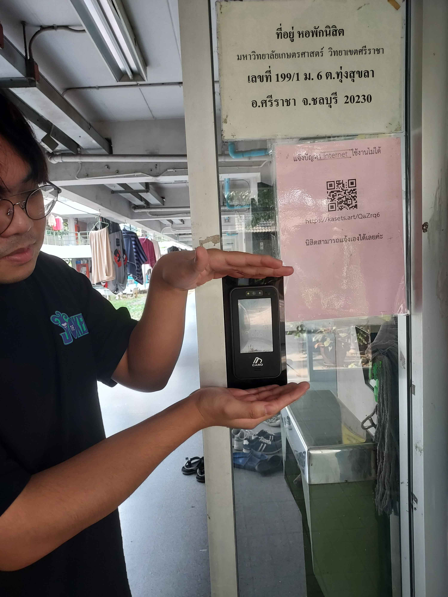

# Security Control 

## 
### Card Reader(เครื่องทาบบัตร)
#### สถานที่ : หอพักนักศึกษา ตึก 2 หอชาย
### รูป แสกนบัตรเข้าหอครับ นั่นแหละ
#### Type of Security Control : Physical Control
#### control function: Preventive Control
#### Description : การสแกนบัตรช่วยป้องกันบุคคลภายนอกที่ไม่ได้รับอนุญาตให้เข้ามาในพื้นที่ส่วนตัว ซึ่งเป็นการควบคุมทางกายภาพ (Physical Control) ที่มุ่งเน้นการปกป้องสถานที่จากภายนอกได้
#### เหตุผลง่ายๆ : ระบบสแกนบัตรเป็นมาตรการควบคุมทางกายภาพที่ช่วยเพิ่มความปลอดภัยในการเข้าถึงพื้นที่ ควบคุมและตรวจสอบได้ง่าย อีกทั้งยังช่วยลดความเสี่ยงจากการเข้าถึงโดยไม่ได้รับอนุญาต ทำให้เป็นทางเลือกที่มีประสิทธิภาพมากกว่าการใช้กุญแจแบบดั้งเดิม
